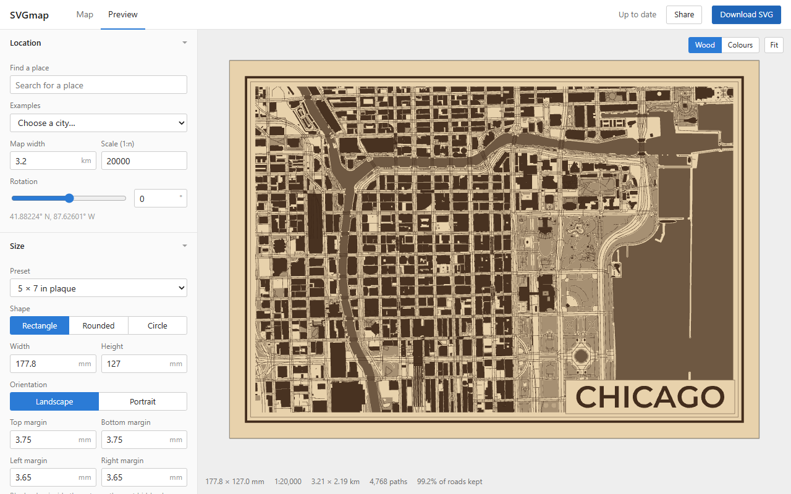

# SVGmap

Make SVG maps of any city from OpenStreetMap data, for laser engraving, pen plotters or print. Everything runs in the browser.

Visit the [GitHub Pages site](https://svgmap.jarvisar.com/) to access the latest deployment.

  

## How to Use

Search for a place or pick one of the example cities. To map a run or ride, import its GPX file under Routes and the map moves to fit it. Drag the map to move the frame, scroll to zoom and right-drag to rotate. On a phone, pinch to zoom and twist to rotate. The frame shows the whole piece, including the margins, border and title.

Click `Generate` to build the SVG. The preview updates as you change settings. Scroll or pinch to zoom the preview and drag to move it. Double-click it or click `Fit` to see the whole piece again. Click `Download SVG` to save the file, or `Share` to copy a link with your settings.

Settings are saved in the browser. `Reset settings` at the bottom of the sidebar puts everything back to the defaults except the location, title and routes.

The settings are:

* Location sets the area. Map width and scale are two ways of saying the same thing.
* Routes adds runs, rides and other routes from GPX and similar files. See below.
* Size sets the piece: a preset (plaques, paper sizes, coasters) or your own width and height, the shape (rectangle, rounded, circle or hexagon), the blank margin inside the cut and the border.
* Output switches between laser, plotter and print.
* Layers turns each kind of feature on or off, sets its colour and how filled areas are drawn (fill, outline or hatching).
* Title adds a title and subtitle in one of seven styles. See below. You can load your own font file.
* Line cleanup removes doubled and crowded lines. See below.
* Map data sets where the map tiles come from, and can add buildings OpenStreetMap is missing. See below.

## Install & Offline Use

SVGmap can be installed as an app. Chrome, Edge and Android show an `Install` prompt at the bottom of the page. The install button in the address bar or browser menu works too. On an iPhone or iPad, tap `Share` and then `Add to Home Screen`.

The app and the title fonts are saved on the first visit, so it opens without a connection. Map tiles are saved as you use them (the last 500 tiles, for up to 30 days), so areas you've already viewed can be generated again offline. Overture building data is saved too (up to 200 MB), so maps you've already added them to work offline as well. Place search always needs a connection, and tiles from a custom source under Map data aren't saved.

When a new version is deployed, a notice asks you to reload. It never reloads on its own.

## Output Modes

* Laser: filled areas engrave, lines score and the edge cuts. Every layer gets its own colour so it can get its own process. The `LightBurn layer palette` option uses LightBurn's colours so each layer lands on its own LightBurn layer, and `Minimal` gives three processes (engrave, score, cut).
* Plotter: everything is a stroke. Filled areas are hatched and the strokes are ordered to cut down pen-up travel. Each pen colour becomes a numbered layer (`1 - pen #000000`) that AxiDraw, vpype and saxi can split on. Single-line Hershey fonts are included for titles.
* Print: coloured themes with wider lines for bigger roads.

The file is sized in millimetres. Check the imported size in your laser software matches the size shown under the preview.

## Title Styles

* Box: one line in a box in a corner, like the original plaque.
* Band: a strip across the top or bottom, like a poster. The map stops short of the divider by the same gap as at the border.
* Ribbon: a banner with folded tails. `Arch` bends it.
* Badge: a round seal with the title over the top, the subtitle along the bottom and a compass rose that points to true north when the map is rotated.
* Big letters: the title across the whole map. The map goes around the letters, or only shows inside them. Showing it inside needs an outline font.
* In border: the title sits in a gap in the border, with the subtitle in the border on the other side. On a round piece it follows the curve.
* Legend: the title, subtitle, a scale bar and a north arrow in a box. The scale bar picks a round distance in metres or feet that fits.

The box, ribbon and badge can be made solid, which engraves the shape and leaves the letters bare. The presets under Title set the style, fonts and options in one click and keep your title text. Those that use coordinates fill them in when the subtitle is empty.

## Line Cleanup

Two lines closer together than the laser beam burn as one dark band. The cleanup comes from my Blender add-on and does the following, in order:

* Joins pieces of the same street into one line
* Removes lines that run close and parallel to a more important one (sidewalks next to roads, doubled tracks)
* Shrinks tiny roundabouts into junctions, since they burn as dots
* Closes small gaps where paths stop just short of a road
* Removes tangles of footpaths that are too dense to read
* Thins out dense patches, but never removes residential streets or anything more important
* Removes short dead ends

A road is never removed in favour of a less important one. The preview shows how much of the road network was kept, and a warning appears below 97%.

`Line spacing` is the main setting. Set it to about your beam width, or 1.5 to 2 times your pen width. The presets change it for each output mode.

## Routes

Import a route under Routes, or drop the file anywhere on the page. GPX, KML, KMZ, TCX and GeoJSON files work, so an activity or route exported from Strava, Garmin Connect, Komoot or Google My Maps can go straight in. Every line in the file becomes part of one route and waypoints are skipped. Pieces of a track less than 500 m apart are joined, since watches start a new piece after a pause.

The map moves to fit the routes when they're added, and `Fit map` does it again. `Fit and rotate` also turns the map when that shows the route at least 10% bigger. Both keep the route out from under the title if there's room beside it. With the scale locked they only move the map.

Each mode draws the route on its own layer in its own colour. Laser engraves it as a band by default, or it can be outlined, hatched or a single scored line. Plotter fills the band with pen passes along the route, in its own pen. Print draws a coloured line. The start gets a dot and the finish a bar across the route. A loop only gets the dot.

The route never goes through the line cleanup. The map gives way to it instead. Streets, paths, railways and areas closer than `Gap around it` are left out, along with leftover bits that run alongside the route or are too short to read. That way nothing is scored again inside an engraved band.

Routes are simplified to within a metre when they're imported and saved with the settings, so they're kept after a reload and included in share links.

## Buildings from Overture

OpenStreetMap is missing a lot of buildings outside big city centers. `Add missing buildings from Overture` under Map data fills them in from [Overture Maps](https://overturemaps.org), mostly with Microsoft's and Google's machine-learning footprints. It's off by default since it's a second download.

Overture's buildings are OSM's plus footprints from other datasets wherever no OSM building overlaps them. Only those other footprints are downloaded, since the OSM ones are already in the tiles. One that overlaps a tile building by more than a quarter of its area is skipped too, since it was probably mapped in OSM after Overture's release. The rest go into the buildings layer like any other building.

How much it adds depends a lot on the place. A 1.5 km wide map of Iztapalapa in Mexico City has a few hundred buildings in OSM, and this adds about 2,500 more from a 3.4 MB download. The default Chicago Loop map only gets 20 more.

## Local Installation

1. Clone the repository:

	`git clone https://github.com/jarvisar/SVGmap.git`

2. Install the dependencies:

	`npm install`

3. Start the dev server:

	`npm run dev`

Run the tests with `npm test`. The live render test is skipped unless `SVGMAP_NETWORK=1` is set.

`npm run build` puts the site in `dist`. Pushing to `main` builds and deploys it with GitHub Actions (`.github/workflows/deploy.yml`). In the repository settings under Pages, the source needs to be set to GitHub Actions.

## Known Issues & Limitations

* Areas that need more than 400 map tiles use less detailed tiles, so small features can be missing. A city center at the default scale needs 4 to 12. The limit can be raised to 2000 under Map data.
* Map tiles store coordinates to about half a metre. At large scales (under about 1:5000) curves can look slightly angular.
* The tiles don't mark sidewalks, so they can't be removed by tag. The cleanup removes most of them because they run next to a road.
* Only SVG export is supported. There is no DXF.
* FIT files can't be read. Most apps and watches can export the activity as GPX instead.
* All routes share one colour and style.
* Routes make share links longer. One from a route planner adds well under 1 KB, but a recorded marathon can add up to about 40 KB.
* Custom fonts can be TTF, OTF or WOFF. WOFF2 files don't load.
* The wood preview is only a rough idea of how the fills will look. Test your settings on scrap.
* On the very first visit, the map style loads before the service worker starts, so it isn't saved until the next visit. Going offline right after a first visit can leave the map blank, but generating still works for tiles that were loaded.
* Overture buildings are only added at full detail (zoom 14), so a map that needs more tiles than the limit gets a warning instead. Maps that would need more than 150 MB of building data, or that cross the 180th meridian, are left without them.
* Machine-learning footprints are rougher than mapped ones: blobby corners, whole blocks merged into one shape, and now and then something that isn't a building.
* With Overture buildings on, every settings change is slower where there are lots of them. The Iztapalapa map above takes about 0.45 s to update instead of 0.1 s.
* If the Overture download fails, the map is drawn with the tiles' buildings and a warning. It's tried again on the next render after a minute, so click `Generate` to retry.

###### Note: map data is from OpenStreetMap. Credit "© OpenStreetMap contributors" on anything you publish or sell, and "Overture Maps Foundation" too if you added Overture buildings.

## Credits

* Map data © [OpenStreetMap](https://www.openstreetmap.org/copyright) contributors
* Vector tiles from [OpenFreeMap](https://openfreemap.org) in the [OpenMapTiles](https://openmaptiles.org) schema
* Extra building footprints from [Overture Maps](https://overturemaps.org) (ODbL)
* Place search by [Photon](https://photon.komoot.io)
* [MapLibre GL JS](https://maplibre.org), [Clipper2](https://github.com/countertype/clipper2-ts), [opentype.js](https://opentype.js.org), [pmtiles](https://github.com/protomaps/PMTiles), [hyparquet](https://github.com/hyparam/hyparquet) and [fzstd](https://github.com/101arrowz/fzstd)
* Fonts: Montserrat, Josefin Sans, Cinzel, Oswald, Bebas Neue and Bitter, under the SIL Open Font License (see `public/fonts`)
* The Hershey Fonts were originally created by Dr. A. V. Hershey while working at the U.S. National Bureau of Standards. The format of the font data was originally created by James Hurt, Cognition, Inc. Glyph data from [hersheytext](https://github.com/techninja/hersheytextjs).
